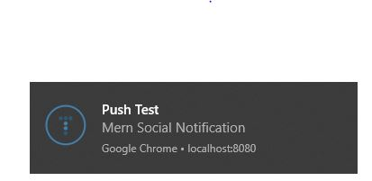

# Push_Notifications_with_Nodejs

Push Notifications created using Web Push library for Nodejs. Here push messages are triggered from a backend via the __Web Push Protocol__.

## Install
Installation is simple, just install via npm.

```
npm install web-push --save
```


